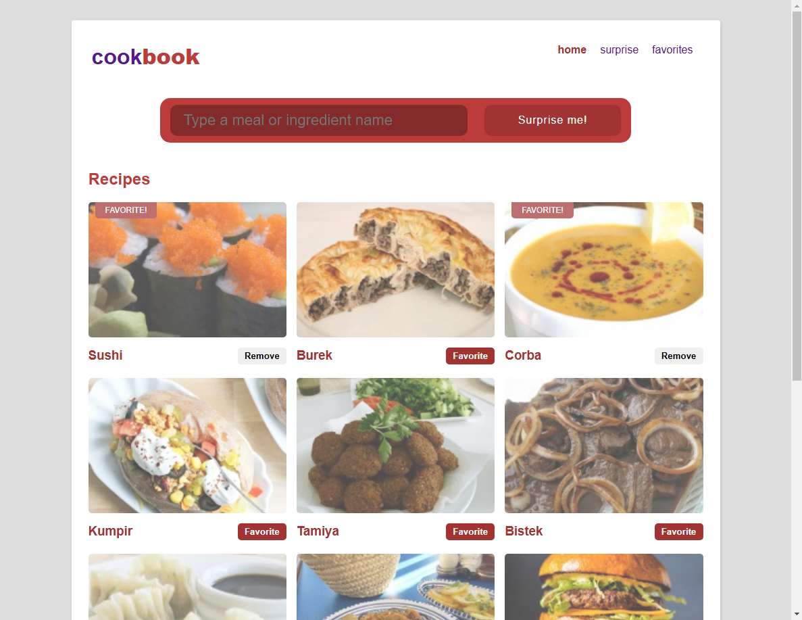
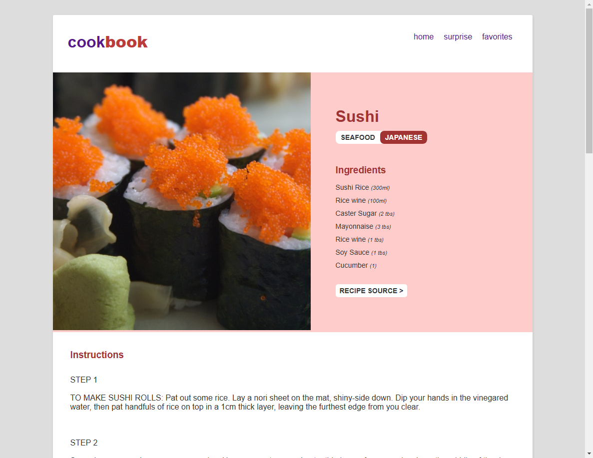
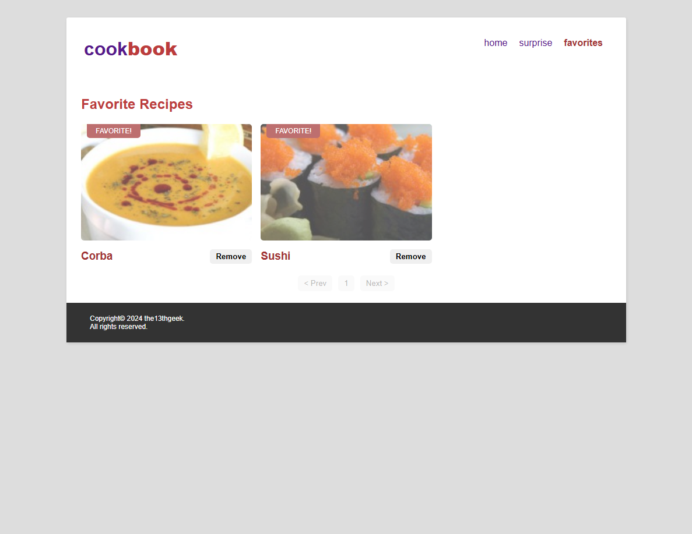

# cookbook
cookbook(R) is a recipe finder utilizing TheMealDB API.

[View the Changelog here](CHANGELOG.md)

## Features
- Searching for recipes by name
- Searching for recipes by ingredient
- Viewing individual recipes by detail
- Choosing/bookmarking recipes

## Installation
### Pre-requisites
- [Node.js](https://nodejs.org/) (v16 or later)
- [Git](https://git-scm.com/)
### Procedure
1. **Clone the repository**
  Run the following command to clone the repository to your local system.
   ```bash
   git clone https://github.com/the13thgeek/cookbook.git
2. Using VSCode or a similar IDE, navigate to the project folder, open the terminal and install the required dependencies:
   ```bash
   npm install
3. Run the application.
   ```env
   npm start
## Solution Approach
- Site loads all recipes by default to allow immediate browsing
- Site searches in real-time as the user proceeds with the input
- Configurable data (such as API URL and page sizing) are stored in a .env file for reusability
- Extra formatting function is provided to handle special characters such as \n and \r on recipe text
- It combines the results of both search-by-title and search-by-ingredients
- Displays a message for the following scenarios:
  - No matching results
  - Errors encountered by the API (API down, etc)
  - Invalid recipe IDs
- All favorited recipes are stored in a table-like object in localStorage. This prevents the Favorites page from sending another HTTP request to TheMealDB API and performing another filter. The Favorites page simply loops through the localStorage favorites object.

## Screenshots
1. Home Page (Desktop)
   
2. Recipe (Single Page/Surprise Recipe) (Desktop)
   
3. Favorites Page (Desktop)
      